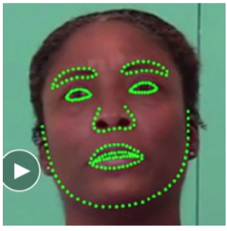

# beat fake

## 简介
本资源为[Deepfake Detection Challenge](https://www.kaggle.com/c/deepfake-detection-challenge)比赛代码。目前比赛已结束，现将代码公开。  

该代码是我们的方案一思路：利用dlib开源库定位人脸的关键点，利用这些关键点构造特征，最终放入XGBoost分类器预测视频的真假。
<div style="align: center">

</div>

## 安装
直接在根目录下，
```{bash}
pip install -r requirements.txt
```
或者查看requirements.txt中所需的包，自行安装自己所需。如果速度太慢，可使用清华镜像，使用方法：
```{bash}
pip install -i https://pypi.tuna.tsinghua.edu.cn/simple xxx # xxx是你所需要安装的包
```
如果安装dlib报错，请先
```{bash}
pip install cmake
```
## 文件目录：
--tools 训练代码（如果需要重新训练定位关键点的模型，可以用这个里面的脚本，使用方法已经在脚本中注明）  
--demo 放置baseline代码  
--data 放置样例视频文件和训练好的数据文件(目前只放了两个视频)  

#### 训练数据文件下载链接[shape_predictor_194_face_landmarks.dat](https://www.dropbox.com/sh/t5h024w0xkedq0j/AABS3GprqIvb_PwqeHOn2dxNa?dl=0)

